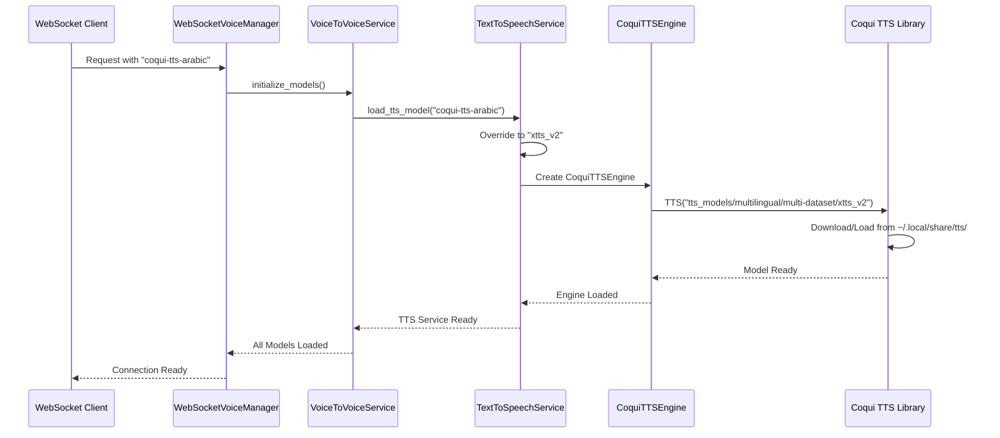

# 🎯 BeautyAI TTS Architecture Analysis Report

## 📋 Executive Summary

This report analyzes the Text-to-Speech (TTS) architecture in the BeautyAI framework, clarifying service relationships, model usage, and resolving confusion between model registry definitions and actual implementation.

### 🔍 Key Findings
- **Actual TTS Model Used**: XTTS v2 (`tts_models/multilingual/multi-dataset/xtts_v2`)
- **Model Registry Discrepancy**: Registry defines different models, but code overrides to XTTS v2
- **Service Architecture**: 4-layer service hierarchy with clear responsibilities
- **Model Storage**: Coqui TTS manages its own cache (`~/.local/share/tts/`), not HuggingFace

---

## 🏗️ Service Architecture Overview

### Service Hierarchy
```
┌─────────────────────────────────────────────────────────────┐
│                    WebSocket Layer                          │
│  websocket_voice.py → WebSocketVoiceManager                │
└─────────────────────┬───────────────────────────────────────┘
                      │
┌─────────────────────▼───────────────────────────────────────┐
│                Voice-to-Voice Service                       │
│  voice_to_voice_service.py → VoiceToVoiceService           │
│  • Orchestrates STT → LLM → TTS pipeline                   │
│  • Manages conversation sessions                            │
└─────────────────────┬───────────────────────────────────────┘
                      │
┌─────────────────────▼───────────────────────────────────────┐
│                Text-to-Speech Service                       │
│  text_to_speech_service.py → TextToSpeechService           │
│  • Unified TTS interface                                    │
│  • Engine selection and model mapping                       │
└─────────────────────┬───────────────────────────────────────┘
                      │
┌─────────────────────▼───────────────────────────────────────┐
│                 Coqui TTS Engine                            │
│  coqui_tts_engine.py → CoquiTTSEngine                      │
│  • Direct Coqui TTS library interface                       │
│  • Model loading and speech generation                      │
└─────────────────────────────────────────────────────────────┘
```

---

## 🔄 Service Relationship Analysis

### 1. WebSocket Voice Endpoint (`websocket_voice.py`)

**Role**: Real-time WebSocket interface for voice conversations

```python
class WebSocketVoiceManager:
    def __init__(self):
        self.voice_service = VoiceToVoiceService()  # Creates V2V service
        self.model_manager = ModelManager()
```

**Responsibilities**:
- ✅ WebSocket connection management
- ✅ Real-time audio streaming
- ✅ Session management and cleanup
- ✅ Error handling and reconnection

### 2. Voice-to-Voice Service (`voice_to_voice_service.py`)

**Role**: Complete pipeline orchestrator

```python
def __init__(self, content_filter_strictness: str = "disabled"):
    # Core services
    self.stt_service = AudioTranscriptionService()
    self.tts_service = TextToSpeechService()        # Creates TTS service
    self.chat_service = ChatService()
    self.content_filter = ContentFilterService(strictness_level=content_filter_strictness)
```

**Responsibilities**:
- ✅ Audio Input → STT → LLM → TTS → Audio Output pipeline
- ✅ Language detection and response matching
- ✅ Session and conversation history management
- ✅ Content filtering and thinking mode handling

### 3. Text-to-Speech Service (`text_to_speech_service.py`)

**Role**: Unified TTS interface with engine abstraction

```python
def load_tts_model(self, model_name: str = "coqui-multilingual", engine_type: str = None):
    # Language-specific model mapping (THE CRITICAL OVERRIDE!)
    language_model_mapping = {
        "coqui-tts-arabic": "tts_models/multilingual/multi-dataset/xtts_v2",
        "coqui-tts-english": "tts_models/multilingual/multi-dataset/xtts_v2", 
        "coqui-tts-multilingual": "tts_models/multilingual/multi-dataset/xtts_v2",
        "coqui-arabic": "tts_models/multilingual/multi-dataset/xtts_v2",
        "coqui-english": "tts_models/multilingual/multi-dataset/xtts_v2",
    }
```

**Responsibilities**:
- ✅ Engine selection (Coqui TTS vs Edge TTS)
- ✅ Model mapping and configuration
- ✅ Speech generation coordination
- ⚠️ **Critical Override**: All models map to XTTS v2

### 4. Coqui TTS Engine (`coqui_tts_engine.py`)

**Role**: Direct interface to Coqui TTS library

```python
def load_model(self) -> None:
    from TTS.api import TTS  # Coqui TTS library
    
    # Always loads XTTS v2 regardless of configuration
    model_name = "tts_models/multilingual/multi-dataset/xtts_v2"
    self.tts = TTS(model_name=model_name, gpu=(self.device == "cuda"))
```

**Responsibilities**:
- ✅ Direct Coqui TTS library interface
- ✅ Model loading and memory management
- ✅ Speech synthesis and voice cloning

---

## 🎯 Model Loading Flow Analysis

### Step-by-Step Process



### Key Override Points

1. **Model Registry Definition** (model_registry.json):
   ```json
   "coqui-tts-arabic": {
     "model_id": "tts_models/ar/tn_arabicspeech/vits"  // ❌ NOT USED
   }
   ```

2. **Service Override** (text_to_speech_service.py):
   ```python
   language_model_mapping = {
     "coqui-tts-arabic": "tts_models/multilingual/multi-dataset/xtts_v2"  // ✅ ACTUAL
   }
   ```

3. **Engine Override** (coqui_tts_engine.py):
   ```python
   model_name = "tts_models/multilingual/multi-dataset/xtts_v2"  // ✅ FINAL
   ```

---

## 📚 XTTS v2 Model Deep Dive

### What is XTTS v2?

**XTTS v2** (Cross-lingual Text-to-Speech version 2) is Coqui AI's flagship multilingual TTS model with advanced voice cloning capabilities.

### Technical Specifications

| Attribute | Details |
|-----------|---------|
| **Full Name** | ⓍTTS v2 (Cross-lingual Text-to-Speech v2) |
| **Python Package** | `coqui-tts` v0.26.2 |
| **Model Size** | 1.8GB (model.pth) + 7.7MB (speakers) |
| **Languages** | 16 languages including Arabic |
| **Voice Cloning** | Yes (3+ seconds audio needed) |
| **Latency** | <200ms (streaming capable) |
| **Audio Quality** | 24kHz high-quality output |
| **GPU Support** | CUDA acceleration available |

### Supported Languages

```
Arabic (ar)     English (en)    Spanish (es)    French (fr)
German (de)     Italian (it)    Portuguese (pt) Polish (pl)
Turkish (tr)    Russian (ru)    Dutch (nl)      Czech (cs)
Chinese (zh)    Japanese (ja)   Korean (ko)     Hindi (hi)
```

### Model Files Location

```
~/.local/share/tts/tts_models--multilingual--multi-dataset--xtts_v2/
├── model.pth           (1.8GB - Main neural network)
├── speakers_xtts.pth   (7.7MB - Speaker embeddings)
├── vocab.json          (361KB - Tokenizer vocabulary)
├── config.json         (4KB - Model configuration)
├── hash.md5            (32B - Integrity check)
└── tos_agreed.txt      (63B - Terms of service)
```

---

## 🔍 XTTS v2 vs Coqui TTS Relationship

### Clear Distinction

```
┌─────────────────────────────────────────────────────────────────┐
│                        Coqui TTS                               │
│                    (Python Framework)                          │
│  ┌─────────────────┐  ┌─────────────────┐  ┌───────────────┐   │
│  │     XTTS v2     │  │      VITS       │  │   Tacotron2   │   │
│  │  (Multilingual  │  │ (Single Lang)   │  │   (Classic)   │   │
│  │ Voice Cloning)  │  │                 │  │               │   │
│  └─────────────────┘  └─────────────────┘  └───────────────┘   │
│  ┌─────────────────┐  ┌─────────────────┐  ┌───────────────┐   │
│  │      Bark       │  │     YourTTS     │  │    FastSpeech │   │
│  │  (Generative)   │  │ (Multilingual)  │  │     (Fast)    │   │
│  └─────────────────┘  └─────────────────┘  └───────────────┘   │
└─────────────────────────────────────────────────────────────────┘
```

### Relationship Explanation

- **Coqui TTS** = The framework/library (`pip install coqui-tts`)
- **XTTS v2** = One specific model within Coqui TTS ecosystem
- **GitHub**: https://github.com/coqui-ai/TTS
- **Documentation**: https://docs.coqui.ai/

### Why XTTS v2 is Used

| Feature | XTTS v2 | Other Models |
|---------|---------|--------------|
| **Arabic Support** | ✅ Native | ❌ Limited |
| **Voice Cloning** | ✅ Advanced | ❌ Basic/None |
| **Multilingual** | ✅ 16 Languages | ❌ Usually Single |
| **Real-time** | ✅ <200ms | ⚠️ Varies |
| **Quality** | ✅ 24kHz High | ⚠️ Varies |

---

## ⚠️ Model Registry Discrepancy Analysis

### The Problem

Your `model_registry.json` defines models that are **never actually used**:

```json
{
  "coqui-tts-arabic": {
    "model_id": "tts_models/ar/tn_arabicspeech/vits",  // ❌ DEFINED
    "description": "Arabic neural voice synthesis"
  },
  "coqui-tts-multilingual": {
    "model_id": "tts_models/multilingual/multi-dataset/xtts_v2"  // ✅ DEFINED
  }
}
```

### The Override Chain

```
model_registry.json
    ↓ (IGNORED)
text_to_speech_service.py → language_model_mapping
    ↓ (OVERRIDES TO XTTS_V2)
coqui_tts_engine.py → hardcoded "xtts_v2"
    ↓ (FINAL)
Coqui TTS Library loads XTTS v2
```

### Why This Happens

1. **Historical Reasons**: Original registry may have defined older models
2. **Quality Improvements**: XTTS v2 provides superior Arabic support
3. **Simplification**: One model handles all languages better than multiple models
4. **Voice Cloning**: XTTS v2's voice cloning capabilities are essential

---

## 🎯 Recommendations

### 1. Update Model Registry (Option A)

Make the registry reflect reality:

```json
{
  "coqui-tts-arabic": {
    "model_id": "tts_models/multilingual/multi-dataset/xtts_v2",
    "description": "XTTS v2 multilingual model optimized for Arabic"
  },
  "coqui-tts-multilingual": {
    "model_id": "tts_models/multilingual/multi-dataset/xtts_v2",
    "description": "XTTS v2 multilingual model with voice cloning"
  }
}
```

### 2. Remove Hardcoded Overrides (Option B)

Clean up the service layer and let registry drive selection:

```python
# Remove this from text_to_speech_service.py:
language_model_mapping = {
    "coqui-tts-arabic": "tts_models/multilingual/multi-dataset/xtts_v2",
    # ... other overrides
}

# Use registry-defined models instead
model_config = self.model_manager.get_model_config(model_name)
model_id = model_config.model_id
```

### 3. Documentation Update (Option C)

Update documentation to clarify that XTTS v2 is the universal TTS model:

```markdown
## TTS Model Configuration

The BeautyAI framework uses XTTS v2 as the universal TTS model for all languages.
While the model registry defines language-specific entries, all requests are
routed to XTTS v2 for optimal quality and voice cloning capabilities.
```

---

## 📊 Performance & Resource Analysis

### Model Resource Usage

| Resource | XTTS v2 | Notes |
|----------|---------|-------|
| **Disk Space** | 1.8GB | Model + embeddings |
| **RAM Usage** | ~2-3GB | During inference |
| **GPU Memory** | ~1-2GB | With CUDA acceleration |
| **CPU Usage** | Medium | Without GPU |
| **Load Time** | 5-10s | First load only |
| **Inference** | <200ms | Per audio chunk |

### Cache Management

```bash
# Coqui TTS models are stored here (NOT HuggingFace):
~/.local/share/tts/

# Total cache size:
du -sh ~/.local/share/tts/
# Output: ~2.0GB

# Clear cache if needed:
rm -rf ~/.local/share/tts/
```

---

## 🔧 Troubleshooting Guide

### Common Issues

1. **Model Not Found**:
   ```bash
   # Check if Coqui TTS is installed:
   pip show coqui-tts
   
   # Reinstall if needed:
   pip install coqui-tts
   ```

2. **Memory Issues**:
   ```python
   # Force CPU usage:
   tts = TTS(model_name="xtts_v2", gpu=False)
   
   # Clear GPU cache:
   torch.cuda.empty_cache()
   ```

3. **Audio Quality Issues**:
   ```python
   # Use higher quality settings:
   tts.tts_to_file(
       text=text,
       speaker="Claribel Dervla",
       language="ar",
       file_path="output.wav"
   )
   ```

---

## 📈 Future Considerations

### Potential Improvements

1. **Model Registry Cleanup**: Align registry with actual usage
2. **Multi-Model Support**: Allow switching between different TTS models
3. **Performance Optimization**: Implement model caching and preloading
4. **Voice Profile Management**: Enhanced voice cloning workflow
5. **Language-Specific Optimization**: Fine-tuning for Arabic dialects

### Architecture Evolution

```
Current: Single XTTS v2 model for everything
    ↓
Future: Smart model selection based on:
    • Language requirements
    • Quality vs speed trade-offs
    • Voice cloning needs
    • Resource constraints
```

---

## 📝 Conclusion

The BeautyAI TTS architecture effectively uses XTTS v2 as a universal multilingual TTS solution with excellent Arabic support. While there's a discrepancy between the model registry and actual implementation, the current setup provides high-quality voice synthesis with advanced features like voice cloning.

The key insight is that **all TTS requests ultimately use XTTS v2**, regardless of the model name specified in the request. This simplifies the architecture while providing optimal quality across all supported languages.

---

## 📚 References

- **Coqui TTS GitHub**: https://github.com/coqui-ai/TTS
- **XTTS v2 Documentation**: https://docs.coqui.ai/en/latest/models/xtts.html
- **BeautyAI Model Registry**: `/home/lumi/beautyai/beautyai_inference/config/model_registry.json`
- **Service Implementation**: `/home/lumi/beautyai/beautyai_inference/services/`

---

*Report generated on July 19, 2025*  
*BeautyAI Framework TTS Architecture Analysis*
