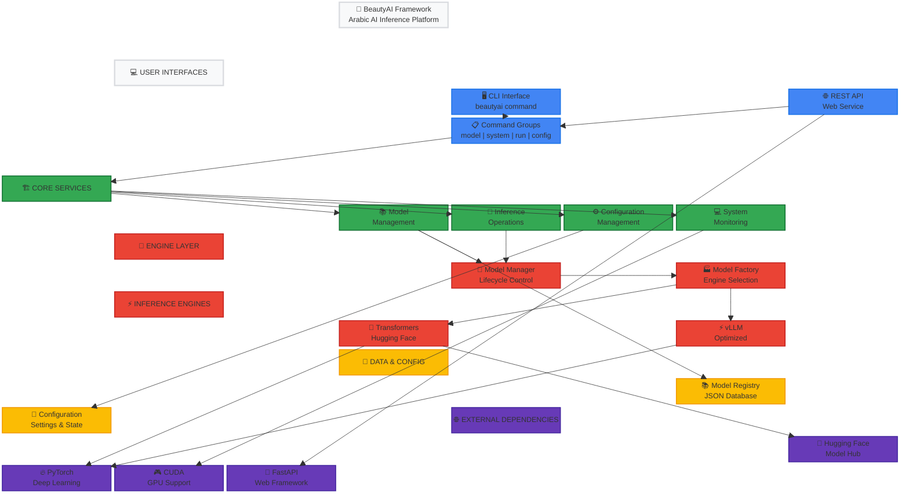

# BeautyAI Inference Framework - Architecture Structure

*Updated: May 27, 2025*

## Executive Summary

This document provides a comprehensive visual representation of the BeautyAI Inference Framework architecture using Mermaid block diagrams. The framework is designed as a scalable, professional-grade system for running inference with Arabic AI models and multilingual language models, featuring both CLI and API interfaces.

## Presentation Overview - High-Level Architecture

This clean, presentation-style block diagram provides a high-level view of the BeautyAI framework architecture, ideal for stakeholder presentations and system overviews.



### Key Architecture Layers

**🔵 Interface Layer (Blue)**
- **CLI Interface**: Primary `beautyai` command with unified structure
- **REST API**: FastAPI-based web service for programmatic access
- **Command Groups**: Organized operations (model, system, run, config)

**🟢 Service Layer (Green)**
- **Model Services**: Registry management and validation
- **Inference Services**: Chat, testing, and benchmarking
- **Config Services**: Configuration management and validation
- **System Services**: Memory monitoring and status reporting

**🔴 Core Engine Layer (Red)**
- **Model Manager**: Centralized model lifecycle management
- **Model Factory**: Intelligent engine selection and creation
- **Inference Engines**: Transformers (default) and vLLM (optimized)

**🟡 Data & Configuration Layer (Yellow)**
- **Model Registry**: JSON-based model configuration database
- **Config Files**: Application settings and runtime state

**🟣 External Dependencies (Purple)**
- **Hugging Face**: Model hub and transformers library
- **PyTorch**: Deep learning framework
- **CUDA**: GPU acceleration support
- **FastAPI**: Modern web framework for API services

### Flow Summary

1. **User Input** → CLI/API interfaces receive commands
2. **Command Routing** → Commands processed by appropriate service layer
3. **Service Processing** → Business logic executed by specialized services
4. **Model Operations** → Model Manager coordinates with inference engines
5. **Inference Execution** → Transformers or vLLM engines process requests
6. **Results** → Responses returned through the interface layer

This architecture ensures scalability, maintainability, and clear separation of concerns while supporting both Arabic AI models and multilingual capabilities.

## Architecture Overview

The BeautyAI framework follows a layered, service-oriented architecture with clear separation of concerns:

1. **Interface Layer**: Unified CLI and REST API interfaces
2. **Service Layer**: Modular business logic services (15 specialized services)  
3. **Core Engine Layer**: Model management and inference engines
4. **Configuration Layer**: Settings and model registry management
5. **Infrastructure Layer**: Utilities and support components
6. **External Dependencies**: Third-party integrations

## Complete Architecture Diagram

```mermaid
block-beta
  columns 12
  
  %% Top Level - Framework Overview
  space:2 BeautyAI["🌟 BeautyAI Inference Framework<br/>Scalable CLI & API for Arabic AI Models"] space:2
  space:6
  
  %% Main Interface Layer  
  CLI["🖥️ CLI Interface<br/>beautyai command"] space:1 API["🌐 REST API<br/>FastAPI Server"] space:1 Legacy["🔄 Legacy Commands<br/>beautyai-chat, etc."]
  
  %% Unified CLI Architecture
  space:2 UnifiedCLI["🎯 Unified CLI<br/>unified_cli.py"] space:1 APIRouter["📡 API Routers<br/>FastAPI endpoints"] space:2
  
  %% Command Groups
  ModelCmds["📝 Model Commands<br/>list, add, remove"] SysCmds["⚙️ System Commands<br/>load, status, cache"] RunCmds["🚀 Run Commands<br/>chat, test, benchmark"] ConfigCmds["🔧 Config Commands<br/>show, set, reset"]
  
  %% Service Layer - The Heart of the Architecture
  space:12
  space:4 ServiceLayer["🏗️ SERVICE LAYER<br/>Core Business Logic"] space:4
  space:12
  
  %% Model Services
  ModelServices["📚 Model Services"] space:2 InferenceServices["🧠 Inference Services"] space:2 ConfigServices["⚙️ Config Services"] space:2 SystemServices["💻 System Services"]
  
  %% Individual Services Detail
  RegistryService["📋 Registry Service<br/>CRUD operations"] LifecycleService["🔄 Lifecycle Service<br/>Load/Unload models"] ValidationService["✅ Model Validation<br/>Compatibility checks"] space:1
  
  ChatService["💬 Chat Service<br/>Interactive sessions"] TestService["🧪 Test Service<br/>Single inference"] BenchmarkService["📊 Benchmark Service<br/>Performance testing"] SessionService["💾 Session Service<br/>Save/Load chats"]
  
  ConfigSvc["🔧 Config Service<br/>Core config ops"] ValidationSvc["✅ Validation Service<br/>Schema validation"] MigrationSvc["🔄 Migration Service<br/>Config migration"] BackupSvc["💾 Backup Service<br/>Config backup/restore"]
  
  MemoryService["🧠 Memory Service<br/>GPU monitoring"] CacheService["🗄️ Cache Service<br/>Cache management"] StatusService["📈 Status Service<br/>System monitoring"] space:1
  
  %% Core Engine Layer
  space:12
  space:4 CoreLayer["🔧 CORE ENGINE LAYER<br/>Model Management & Inference"] space:4
  space:12
  
  %% Core Components
  ModelManager["🎯 Model Manager<br/>Singleton - Lifecycle"] ModelFactory["🏭 Model Factory<br/>Engine Creation"] ModelInterface["📐 Model Interface<br/>Abstract Base Class"] space:1
  
  %% Inference Engines
  TransformersEngine["🤗 Transformers Engine<br/>Hugging Face Backend"] VLLMEngine["⚡ vLLM Engine<br/>Optimized Inference"] space:2
  
  %% Configuration & Data Layer
  space:12
  space:3 ConfigLayer["📁 CONFIGURATION & DATA LAYER<br/>Settings & Model Registry"] space:3
  space:12
  
  %% Configuration Components
  ConfigManager["⚙️ Config Manager<br/>AppConfig & ModelConfig"] ModelRegistry["📚 Model Registry<br/>model_registry.json"] DefaultConfig["🔧 Default Config<br/>default_config.json"] StateManager["💾 State Manager<br/>loaded_models_state.json"]
  
  %% Infrastructure & Utilities
  space:12
  space:4 InfraLayer["🛠️ INFRASTRUCTURE LAYER<br/>Utilities & Support"] space:4
  space:12
  
  %% Infrastructure Components
  MemoryUtils["🧠 Memory Utils<br/>GPU monitoring"] ArgumentConfig["📝 Argument Config<br/>CLI standardization"] APISchemas["📋 API Schemas<br/>Request/Response models"] space:1
  
  %% External Dependencies
  space:12
  space:4 ExternalLayer["🌐 EXTERNAL DEPENDENCIES<br/>Third-party integrations"] space:4
  space:12
  
  %% External Components
  HuggingFace["🤗 Hugging Face<br/>Models & Transformers"] PyTorch["🔥 PyTorch<br/>Deep Learning Framework"] CUDA["🎮 CUDA<br/>GPU Acceleration"] FastAPI["🚀 FastAPI<br/>Web Framework"]
  
  %% Flow Connections - Primary Data Flow
  CLI --> UnifiedCLI
  API --> APIRouter
  Legacy --> UnifiedCLI
  
  UnifiedCLI --> ModelCmds
  UnifiedCLI --> SysCmds  
  UnifiedCLI --> RunCmds
  UnifiedCLI --> ConfigCmds
  
  APIRouter --> ModelServices
  APIRouter --> InferenceServices
  APIRouter --> ConfigServices
  APIRouter --> SystemServices
  
  %% Command to Service Routing
  ModelCmds --> ModelServices
  SysCmds --> SystemServices
  RunCmds --> InferenceServices
  ConfigCmds --> ConfigServices
  
  %% Service Decomposition
  ModelServices --> RegistryService
  ModelServices --> LifecycleService
  ModelServices --> ValidationService
  
  InferenceServices --> ChatService
  InferenceServices --> TestService
  InferenceServices --> BenchmarkService
  InferenceServices --> SessionService
  
  ConfigServices --> ConfigSvc
  ConfigServices --> ValidationSvc
  ConfigServices --> MigrationSvc
  ConfigServices --> BackupSvc
  
  SystemServices --> MemoryService
  SystemServices --> CacheService
  SystemServices --> StatusService
  
  %% Core Engine Connections
  LifecycleService --> ModelManager
  ModelManager --> ModelFactory
  ModelFactory --> ModelInterface
  
  ModelInterface --> TransformersEngine
  ModelInterface --> VLLMEngine
  
  %% Configuration Layer Connections
  RegistryService --> ModelRegistry
  ConfigSvc --> ConfigManager
  ConfigManager --> DefaultConfig
  ModelManager --> StateManager
  
  %% Infrastructure Connections
  UnifiedCLI --> ArgumentConfig
  APIRouter --> APISchemas
  SystemServices --> MemoryUtils
  
  %% External Dependencies
  TransformersEngine --> HuggingFace
  TransformersEngine --> PyTorch
  VLLMEngine --> PyTorch
  SystemServices --> CUDA
  APIRouter --> FastAPI
  
  %% Styling
  classDef interface fill:#4285f4,stroke:#1a73e8,stroke-width:2px,color:#fff
  classDef service fill:#34a853,stroke:#137333,stroke-width:2px,color:#fff
  classDef core fill:#ea4335,stroke:#c5221f,stroke-width:2px,color:#fff
  classDef config fill:#fbbc04,stroke:#f29900,stroke-width:2px,color:#000
  classDef infra fill:#9aa0a6,stroke:#5f6368,stroke-width:2px,color:#fff
  classDef external fill:#673ab7,stroke:#4527a0,stroke-width:2px,color:#fff
  classDef layer fill:#f8f9fa,stroke:#dadce0,stroke-width:3px,color:#202124
  
  class CLI,API,Legacy,UnifiedCLI,APIRouter,ModelCmds,SysCmds,RunCmds,ConfigCmds interface
  class ServiceLayer,ModelServices,InferenceServices,ConfigServices,SystemServices service
  class RegistryService,LifecycleService,ValidationService,ChatService,TestService,BenchmarkService,SessionService service
  class ConfigSvc,ValidationSvc,MigrationSvc,BackupSvc,MemoryService,CacheService,StatusService service
  class CoreLayer,ModelManager,ModelFactory,ModelInterface,TransformersEngine,VLLMEngine core
  class ConfigLayer,ConfigManager,ModelRegistry,DefaultConfig,StateManager config
  class InfraLayer,MemoryUtils,ArgumentConfig,APISchemas infra
  class ExternalLayer,HuggingFace,PyTorch,CUDA,FastAPI external
  class BeautyAI layer
```



## Layer Breakdown

### 🔵 Interface Layer (Blue)
**Purpose**: User-facing interfaces and command routing
- **CLI Interface**: Main `beautyai` command with unified structure
- **REST API**: FastAPI-based web service for programmatic access
- **Legacy Support**: Backward compatibility with existing commands
- **Command Groups**: Organized into model, system, run, and config operations

### 🟢 Service Layer (Green) 
**Purpose**: Core business logic organized into specialized services
- **Model Services**: Registry management, lifecycle, and validation
- **Inference Services**: Chat, testing, benchmarking, and session management
- **Config Services**: Configuration CRUD, validation, migration, and backup
- **System Services**: Memory monitoring, cache management, and status reporting

### 🔴 Core Engine Layer (Red)
**Purpose**: Model management and inference execution
- **Model Manager**: Singleton pattern for model lifecycle management
- **Model Factory**: Factory pattern for creating appropriate inference engines
- **Model Interface**: Abstract base class ensuring consistent engine behavior
- **Inference Engines**: Transformers (default) and vLLM (optimized) backends

### 🟡 Configuration Layer (Yellow)
**Purpose**: Settings, registry, and state persistence
- **Config Manager**: Application and model configuration management
- **Model Registry**: JSON-based model configuration storage
- **Default Config**: Framework default settings
- **State Manager**: Cross-process model state tracking

### ⚫ Infrastructure Layer (Gray)
**Purpose**: Utilities and support components
- **Memory Utils**: GPU memory monitoring and management
- **Argument Config**: Standardized CLI argument handling
- **API Schemas**: Request/response models for web API

### 🟣 External Dependencies (Purple)
**Purpose**: Third-party integrations and frameworks
- **Hugging Face**: Model hub and Transformers library
- **PyTorch**: Deep learning framework
- **CUDA**: GPU acceleration
- **FastAPI**: Web framework for API services

## Key Architectural Patterns

### 1. Service-Oriented Architecture
- **Single Responsibility**: Each service has a focused purpose
- **Dependency Injection**: Services are configurable and testable
- **Interface Segregation**: Clear boundaries between service types
- **API-Ready**: Services designed for both CLI and web interfaces

### 2. Factory Pattern
- **Model Factory**: Creates appropriate inference engines based on configuration
- **Engine Selection**: Automatic fallback (vLLM → Transformers for seq2seq models)
- **Architecture Detection**: Automatic model type detection (causal vs seq2seq)

### 3. Singleton Pattern
- **Model Manager**: Centralized model lifecycle management
- **Cross-Process State**: Shared state management across CLI invocations
- **Resource Management**: GPU memory optimization and cleanup

### 4. Adapter Pattern
- **CLI Service Integration**: Bridges old CLI interface with new services
- **Backward Compatibility**: Maintains existing command functionality
- **API Integration**: Same services power both CLI and REST API

## Data Flow Examples

### Model Loading Flow
```
CLI Command → Unified CLI → System Commands → Model Services → 
Lifecycle Service → Model Manager → Model Factory → Inference Engine → 
Hugging Face/PyTorch → GPU Memory
```

### Chat Session Flow
```
CLI Command → Unified CLI → Run Commands → Inference Services → 
Chat Service → Model Manager → Loaded Model → Streaming Response → 
Session Service (optional save)
```

### Configuration Management Flow
```
CLI Command → Unified CLI → Config Commands → Config Services → 
Config Service → Config Manager → JSON Files → Validation Service
```

## File Structure Mapping

### Core Framework Files
```
beautyai_inference/
├── cli/
│   ├── unified_cli.py           # 🎯 Main CLI entry point
│   ├── argument_config.py       # 📝 Standardized arguments
│   └── handlers/                # CLI-specific handlers
├── services/                    # 🏗️ Service layer (15 services)
│   ├── base/                    # Base service infrastructure
│   ├── model/                   # Model management services
│   ├── inference/               # Inference operation services
│   ├── config/                  # Configuration services
│   └── system/                  # System monitoring services
├── core/                        # 🔧 Core engine components
│   ├── model_manager.py         # Singleton model manager
│   ├── model_factory.py         # Engine factory
│   └── model_interface.py       # Engine interface
├── inference_engines/           # Engine implementations
│   ├── transformers_engine.py   # Hugging Face backend
│   └── vllm_engine.py          # vLLM backend
├── config/                      # 📁 Configuration management
│   ├── config_manager.py        # Configuration classes
│   ├── model_registry.json      # Model configurations
│   └── default_config.json      # Default settings
├── api/                         # 🌐 REST API components
│   ├── app.py                   # FastAPI application
│   ├── endpoints/               # API route handlers
│   ├── schemas/                 # Request/response models
│   └── middleware/              # API middleware
└── utils/                       # 🛠️ Utilities
    └── memory_utils.py          # GPU monitoring
```

## Benefits of This Architecture

### 1. Maintainability
- **Modular Design**: Each component has clear responsibilities
- **Service Isolation**: Easy to modify individual services
- **Clean Dependencies**: Well-defined inter-service relationships

### 2. Scalability
- **Horizontal Scaling**: Services can be deployed independently
- **Resource Optimization**: Memory and GPU management
- **Backend Flexibility**: Multiple inference engine support

### 3. Testability
- **Unit Testing**: Individual services can be tested in isolation
- **Integration Testing**: Clear interfaces enable comprehensive testing
- **Mocking**: Services can be easily mocked for testing

### 4. Future-Ready
- **API Integration**: Services designed for web service deployment
- **Microservices**: Ready for containerization and distributed deployment
- **Extension Points**: Easy to add new services and functionality

## Usage Examples

### CLI Interface
```bash
# Model management
beautyai model list
beautyai model add --name my-model --model-id "vendor/model-id"

# System operations  
beautyai system load my-model
beautyai system status

# Inference operations
beautyai run chat --model-name my-model
beautyai run benchmark --model-name my-model

# Configuration
beautyai config show
beautyai config set default_engine vllm
```

### API Interface
```bash
# REST API endpoints
POST /models              # Add model to registry
GET /models               # List models
POST /system/load         # Load model into memory
GET /system/status        # Get system status
POST /inference/chat      # Start chat session
POST /inference/benchmark # Run benchmark
```

## Technical Specifications

### Supported Model Types
- **Causal Language Models**: Qwen, Mistral, Llama, GPT-style models
- **Sequence-to-Sequence**: T5, Flan-T5, BART models
- **Arabic Models**: Specialized Arabic language model support

### Quantization Support
- **Transformers Backend**: 4-bit/8-bit BitsAndBytes quantization
- **vLLM Backend**: AWQ and SqueezeLLM quantization
- **Automatic Selection**: Best quantization method per model type

### Hardware Requirements
- **GPU**: NVIDIA GPU with CUDA support (RTX 4090 24GB recommended)
- **Memory**: Varies by model size and quantization
- **Python**: 3.10+ with PyTorch and required dependencies

## Conclusion

The BeautyAI Inference Framework represents a mature, production-ready architecture that successfully balances:

- **Simplicity**: Easy-to-use CLI interface for quick operations
- **Power**: Advanced features for complex inference workflows  
- **Flexibility**: Multiple backends and configuration options
- **Scalability**: Service-oriented design ready for enterprise deployment

The comprehensive service refactoring and API foundation provide a solid foundation for future enhancements while maintaining full backward compatibility with existing workflows.
